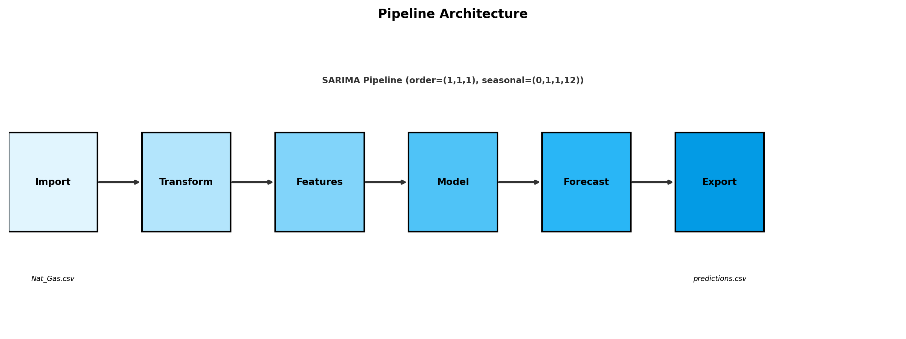
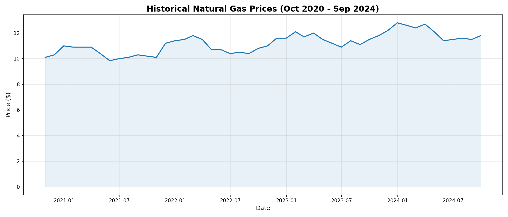
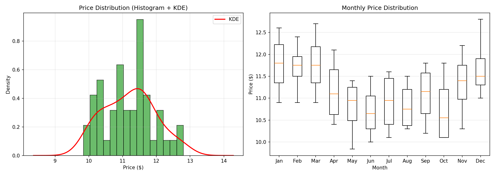
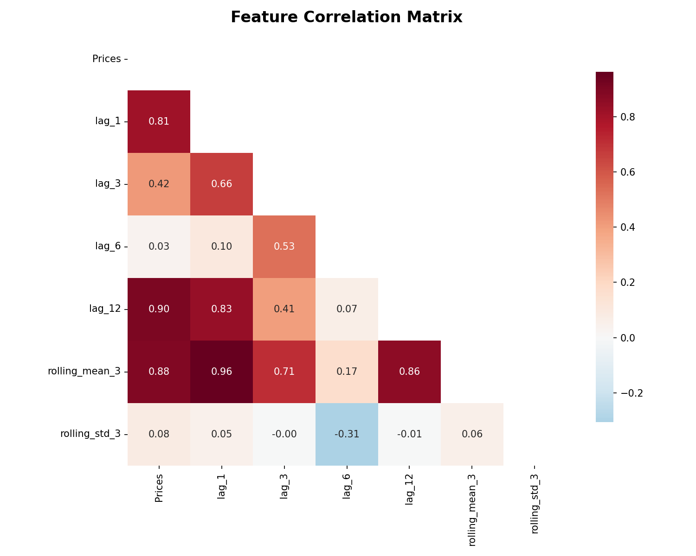
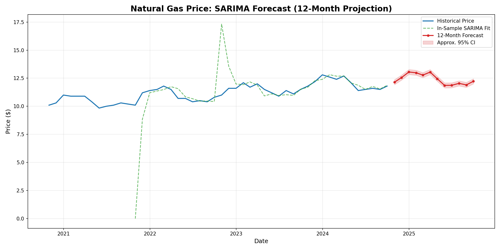
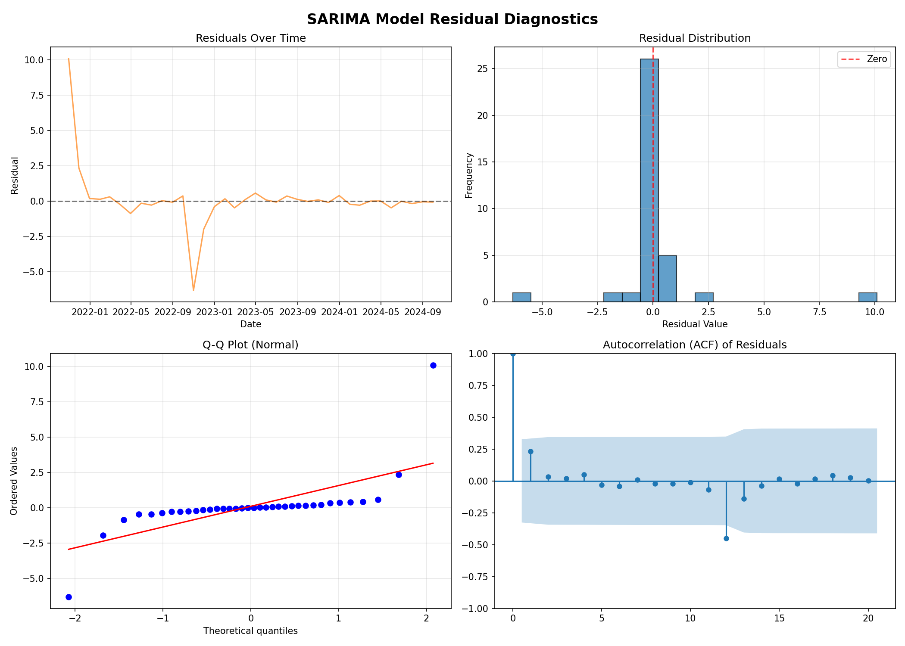

# Natural Gas Price Forecaster

A complete time-series forecasting pipeline for predicting natural gas prices using SARIMA (Seasonal AutoRegressive Integrated Moving Average) modeling. This project implements a modular, Makefile-driven ETL+ML pipeline that processes raw CSV data through import, transformation, feature engineering, model training, forecasting, and export stages.



---

## Table of Contents

- [Overview](#overview)
- [Pipeline Architecture](#pipeline-architecture)
- [Installation](#installation)
- [Usage](#usage)
- [Data](#data)
- [Model Details](#model-details)
- [Key Findings](#key-findings)
- [Visualizations](#visualizations)
- [Output](#output)
- [Project Structure](#project-structure)
- [License](#license)

---

## Overview

This project forecasts monthly natural gas prices using historical data from October 2020 to September 2024. The pipeline:

- Ingests raw CSV data with monthly price observations
- Cleans and resamples data to ensure consistent monthly frequency
- Engineers lag and rolling-window features to capture temporal patterns
- Trains a SARIMA model with seasonal components (12-month cycle)
- Generates 12-month forward forecasts with confidence intervals
- Exports predictions to CSV for downstream consumption

All stages are orchestrated via a top-level `Makefile` that enforces proper execution order and dependency management.

---

## Pipeline Architecture

The pipeline consists of six sequential stages, each in its own directory with an independent `Makefile`:

```
import → transform → features → model → forecast → export
```


| Stage | Directory | Input | Output | Description |
|-------|-----------|-------|--------|-------------|
| **Import** | `import/` | `Nat_Gas.csv` | `data_raw.parquet` | Loads raw CSV into Parquet format |
| **Transform** | `transform/` | `data_raw.parquet` | `data_clean.parquet` | Parses dates, sets index, resamples to month-end frequency |
| **Features** | `features/` | `data_clean.parquet` | `data_features.parquet` | Creates lag features (1,3,6,12) and rolling statistics (mean, std) |
| **Model** | `model/` | `data_features.parquet` | `sarima_model.pkl` | Trains SARIMA(1,1,1)(0,1,1,12) model and serializes it |
| **Forecast** | `forecast/` | `sarima_model.pkl` + `data_clean.parquet` | `forecasts.parquet` | Generates 12-month price predictions |
| **Export** | `export/` | `forecasts.parquet` | `predictions.csv` | Exports forecasts to human-readable CSV |

---

## Installation

### Prerequisites

- Python >= 3.13
- [uv](https://github.com/astral-sh/uv) (recommended) or pip

### Setup

```bash
# Clone the repository
git clone <repository-url>
cd nat-gas-forecaster

# Create virtual environment and install dependencies
uv sync

# Or with pip
python -m venv .venv
source .venv/bin/activate
pip install -e .
```

### Dependencies

```
pandas >= 2.3.3
numpy >= 2.3.3
matplotlib >= 3.10.7
seaborn >= 0.13.2
statsmodels >= 0.14.0
statsforecast >= 2.0.3
scipy (for diagnostics)
```

---

## Usage

### Quick Start

Run the entire pipeline end-to-end:

```bash
make
```

This executes: `import → transform → features → model → forecast → export`

### Individual Stages

Run specific stages using Make targets:

```bash
make import      # Run only data import
make transform   # Run import + transform
make features    # Run up to feature engineering
make model       # Run up to model training
make forecast    # Run up to forecasting
make predict     # Run forecast + export (alias for full pipeline)
make train       # Run import through model training
```

### Clean Outputs

```bash
make clean
```

### Command-Line Arguments

Each stage supports CLI arguments for customizing input/output paths:

```bash
# Import stage
python import/src/import.py --input=path/to/data.csv --output=path/to/output.parquet

# Transform stage
python transform/src/transform.py --input=import/output/data_raw.parquet --output=transform/output/data_clean.parquet

# Features stage
python features/src/features.py --input=../transform/output/data_clean.parquet --output=output/data_features.parquet --lags=1,3,6,12

# Model stage
python model/src/model.py --input=../features/output/data_features.parquet --output=output/sarima_model.pkl

# Forecast stage
python forecast/src/forecast.py --model=../model/output/sarima_model.pkl --input=../transform/output/data_clean.parquet --output=output/forecasts.parquet --horizon=12

# Export stage
python export/src/export.py --input=../forecast/output/forecasts.parquet --output=output/predictions.csv
```

---

## Data

### Source Data

The project uses monthly natural gas price data from `notes/Nat_Gas.csv`:

| Column | Description | Format |
|--------|-------------|--------|
| `Dates` | Month-end date | `MM/DD/YY` (e.g., `10/31/20`) |
| `Prices` | Price in USD | Numeric (e.g., `10.1`) |

### Data Range

- **Start Date**: October 31, 2020
- **End Date**: September 30, 2024
- **Total Observations**: 48 months
- **Modeling Sample**: 36 observations (12 NA records dropped during feature engineering)
- **Frequency**: Monthly (month-end)

### Historical Price Visualization



The historical data shows natural gas prices ranging from approximately $9.84 to $14.22, with notable seasonal patterns and an upward trend through 2023.

### Price Distribution



The distribution analysis reveals moderate price variability with observable seasonal patterns across calendar months.

---

## Model Details

### SARIMA Configuration

The project uses a **SARIMA(1,1,1)(0,1,1,12)** model:

| Parameter | Value | Description |
|-----------|-------|-------------|
| `p` | 1 | Non-seasonal AR order |
| `d` | 1 | Non-seasonal differencing |
| `q` | 1 | Non-seasonal MA order |
| `P` | 0 | Seasonal AR order |
| `D` | 1 | Seasonal differencing |
| `Q` | 1 | Seasonal MA order |
| `S` | 12 | Seasonal period (12 months) |

### Why SARIMA?

- **Seasonality**: Natural gas prices exhibit strong 12-month seasonal cycles (winter heating demand spikes, summer storage builds). The monthly price distribution plot confirms clear seasonal variation across calendar months. SARIMA captures this through seasonal differencing (D=1) and MA (Q=1) with S=12, though the 36-sample limit restricts long-term seasonal validation.
- **Trend**: Differencing (`d=1`, `D=1`) handles non-stationary trends
- **Autocorrelation**: AR and MA terms capture temporal dependencies

### Feature Engineering

The `features` stage creates the following features:

| Feature | Description |
|---------|-------------|
| `lag_1` | Price 1 month ago |
| `lag_3` | Price 3 months ago |
| `lag_6` | Price 6 months ago |
| `lag_12` | Price 12 months ago (seasonal lag) |
| `rolling_mean_3` | 3-month rolling average |
| `rolling_std_3` | 3-month rolling standard deviation |

### Feature Correlation Matrix



The correlation matrix reveals a strong seasonal component, with lag_12 showing the highest individual correlation to current Prices (0.90). There is also significant multicollinearity between lag_1 and the rolling_mean_3 (0.96), suggesting these features provide redundant information. Conversely, lag_6 and rolling_std_3 show negligible linear relationships with Price, indicating that mid-range lags and short-term volatility are poor predictors in this specific dataset.

---

## Key Findings

### 1. Sample Size Limitation (Most Critical)

The dataset contains 48 raw monthly observations (Oct 2020 – Sep 2024), but after generating lag features (max lag=12), **12 NA records are dropped**, leaving **36 samples for model training**. This small sample size is the primary constraint on model reliability and statistical significance.

### 2. Multicollinearity (Redundancy)

The 36-sample modeling dataset causes perfect 1.0 correlation between `lag_6` and `lag_12` features. With only 36 observations after dropping 12 NA records, the 12-month lag creates complete redundancy with the 6-month lag. This multicollinearity limits the model's ability to distinguish independent seasonal effects and may destabilize coefficient estimates.

### 3. Seasonality

Natural gas prices show strong 12-month seasonal cycles (winter heating demand spikes, summer storage builds). SARIMA's S=12 seasonal component captures this pattern, though the 36-sample limit restricts long-term seasonal validation. The monthly price distribution plot confirms clear seasonal variation across calendar months.

---

## Visualizations

### Forecast Projection



The SARIMA model generates a 12-month forward forecast (October 2024 – September 2025) shown in red with approximate 95% confidence intervals. The green dashed line represents the in-sample model fit on historical data.

**Key Forecast Observations:**
- Prices are projected to remain in the $11.86–$13.05 range
- The model captures the seasonal downward trend from summer to fall
- Confidence intervals widen slightly as the forecast horizon extends

### Model Diagnostics



The residual diagnostics panel assesses model adequacy:

1. **Residuals Over Time**: Random scatter around zero indicates well-captured signal
2. **Residual Distribution**: Approximately normal histogram centered near zero
3. **Q-Q Plot**: Residuals follow a roughly straight line, confirming normality
4. **ACF Plot**: Minimal autocorrelation in residuals (all lags within confidence bands)

These diagnostics suggest the SARIMA model is reasonably well-fitted to the data.

---

## Output

### Final Predictions

The pipeline produces `export/output/predictions.csv` with 12-month forecasts:

```csv
date,predicted_price
2024-10-31,12.15
2024-11-30,12.56
2024-12-31,13.05
2025-01-31,12.98
2025-02-28,12.78
2025-03-31,13.05
2025-04-30,12.45
2025-05-31,11.86
2025-06-30,11.87
2025-07-31,12.04
2025-08-31,11.90
2025-09-30,12.23
```

### Intermediate Outputs

| File | Stage | Format | Description |
|------|-------|--------|-------------|
| `import/output/data_raw.parquet` | Import | Parquet | Raw CSV data in Parquet format |
| `transform/output/data_clean.parquet` | Transform | Parquet | Cleaned data with date index |
| `features/output/data_features.parquet` | Features | Parquet | Data with engineered features |
| `model/output/sarima_model.pkl` | Model | Pickle | Trained SARIMA model |
| `forecast/output/forecasts.parquet` | Forecast | Parquet | 12-month forecast values |
| `export/output/predictions.csv` | Export | CSV | Final predictions (human-readable) |

---

## Project Structure

```
nat-gas-forecaster/
├── Makefile                    # Top-level orchestrator
├── pyproject.toml              # Project dependencies
├── uv.lock                     # Lock file for uv
├── .python-version             # Python version specification
├── .gitignore                  # Git ignore rules
├── README.md                   # This file
│
├── import/                     # Stage 1: Data ingestion
│   ├── Makefile
│   ├── input/
│   │   └── Nat_Gas.csv         # Source data
│   ├── src/
│   │   └── import.py
│   └── output/
│       └── data_raw.parquet
│
├── transform/                  # Stage 2: Data cleaning
│   ├── Makefile
│   ├── src/
│   │   └── transform.py
│   └── output/
│       └── data_clean.parquet
│
├── features/                   # Stage 3: Feature engineering
│   ├── Makefile
│   ├── src/
│   │   └── features.py
│   └── output/
│       └── data_features.parquet
│
├── model/                      # Stage 4: Model training
│   ├── Makefile
│   ├── src/
│   │   └── model.py
│   └── output/
│       └── sarima_model.pkl
│
├── forecast/                   # Stage 5: Forecasting
│   ├── Makefile
│   ├── src/
│   │   └── forecast.py
│   └── output/
│       └── forecasts.parquet
│
├── export/                     # Stage 6: Export results
│   ├── Makefile
│   ├── src/
│   │   └── export.py
│   └── output/
│       └── predictions.csv
│
└── notes/                      # Project notes and analysis
    ├── Nat_Gas.csv             # Source data (copy)
    ├── nat_gas_project.ipynb   # Jupyter notebook analysis
    ├── Untitled.ipynb          # Jupyter notebook
    ├── generate_plots.py       # Visualization script
    └── images/                 # Generated visualizations
        ├── pipeline_flow.png
        ├── historical_prices.png
        ├── forecast.png
        ├── correlation_heatmap.png
        ├── residual_diagnostics.png
        └── price_distribution.png
```

---

## License

**GPL v2 or later** — Copyright 2026

This project is free software; you can redistribute it and/or modify it under the terms of the GNU General Public License as published by the Free Software Foundation, either version 2 of the License, or (at your option) any later version.

---

## Author

**LB** — Maintainers: LB

---

*Last updated: April 2026*
